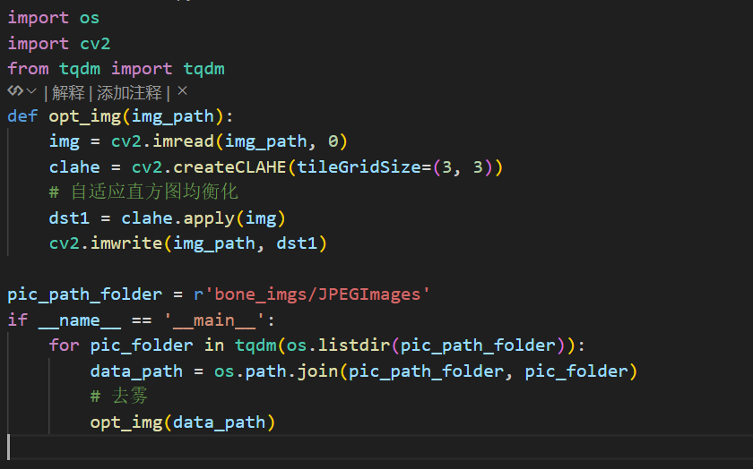
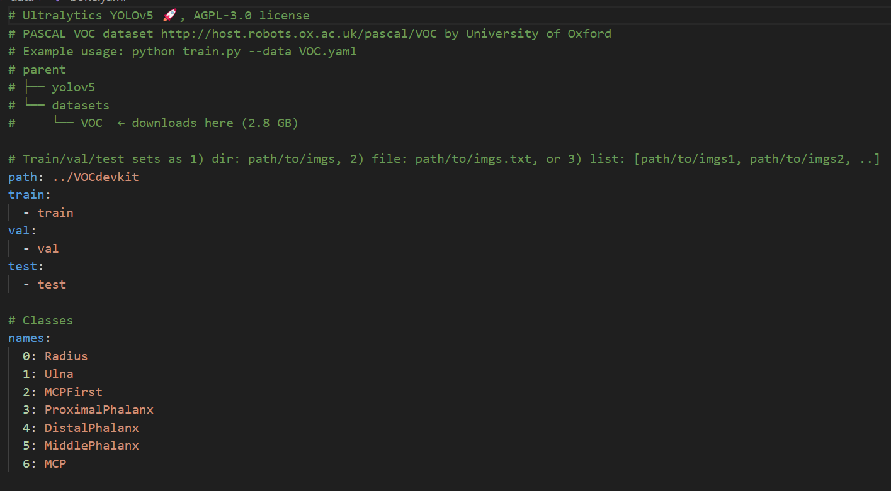
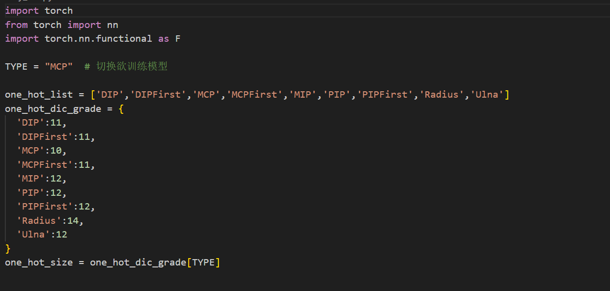
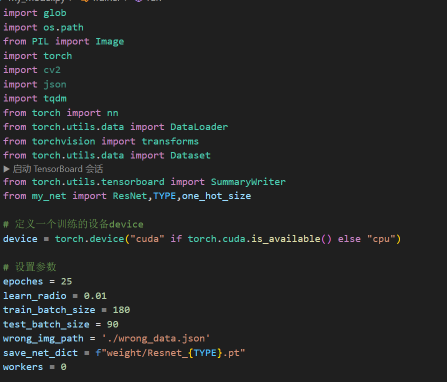

# 1.数据集  
## 1.1手部X光骨龄1000张(基于RUS-CHN法)  
https://aistudio.baidu.com/datasetdetail/73376/1  
## 1.2X光手部小关节分类数据集（基于骨龄计分法RUS-CHN）  
https://aistudio.baidu.com/datasetdetail/69582  
大家也可以使用自己或者其他的一些数据集进行训练。  
关节数据集是我处理过的，后文会讲述处理方法，大家可以自行调整。  
# 2.数据处理  
分析我们获取的数据集，发现很多图片有雾感（即图像中像素几乎集中在一个区间，导致图片中的对比度不强，给我们呈现出雾感），会影响模型的训练，于是采用直方图均衡化来进行处理。
## 2.1手骨处理  
bone_createCLAHE.py  
数据集图片自适应直方图均衡化  
  
xml_to_txt.py  
xml标注转为txt  
  
split_dataset.py  
将图片和标注数据按比例切分为 训练集和测试集  
  
## 2.2 关节处理  
bone9_createCLAHE.py  
数据集图片自适应直方图均衡化  
  
pic_power.py  
图像增强，数据集增强至每份1800，再按比例随机抽样到test目录下。  
增强完毕过后进行预处理同一大小。  
  
# 3 网络模型训练  
## 3.1 侦测模型训练  
bone.yaml  
在克隆的YOLOV5中，重新配置所需的yaml文件  
  
yolov5s.yaml  
需要更改分类数量，改为7  
  
train.py  
yolov5的训练程序train中需要更改一些参数  
  
best.pt  
训练结束后，最优权重文件会保存在run文件夹下  
## 3.2 分类模型训练  
my_net.py  
定义自己的分类网络  
我采用的Resnet18训练效果较好。  
DIP、DIPFirst、MCP、MCPFirst、MIP、PIP、PIPFirst、Radius、Ulna  
测试准确度达到90%以上。  
  
my_model.py  
分类模型训练，需要训练9个模型  
  
训练完成后，最优权重会按关节名称进行保存。  
# 4 骨龄检测  
检测流程：  
bone_window：可视化输入  
analyse_bone_age：检测手骨筛选关节  
screen_bone：不同网络对对应关节评级分类  
common：根据关节等级计算分数年龄  
analyse_bone_age：返回画框图片与计算结果  
bone_window：可视化输出  
# 5.效果展示  
https://www.bilibili.com/video/BV1MKvreCEge/?spm_id_from=333.1387.homepage.video_card.click